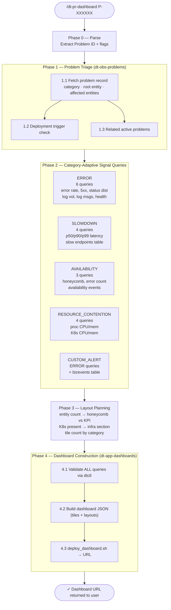

# dt-pr-dashboard

## Status

| Field | Value |
|---|---|
| **Status** | Active |
| **Invoke** | `/dt-pr-dashboard <P-ID>` |
| **License** | Apache-2.0 |
| **Last updated** | 2026-05-27 |

---

## Purpose

Given a Dynatrace Problem ID, diagnose the full root cause from live telemetry and deploy a Dynatrace dashboard that gives any operator an immediate operational view of the incident — entity health, active problems, category-adaptive signal charts, affected service metrics, blast radius, and a live verification row to confirm when the fix has taken hold.

Dashboards are simultaneous, not narrative. Every tile must be independently interpretable at a glance. Visualization choice is as important as the queries.

---

## Usage

```
/dt-pr-dashboard P-260530039
/dt-pr-dashboard P-260530039 --title "EasyTrade Incident — Ops View"
/dt-pr-dashboard P-260530039 --epoch false
/dt-pr-dashboard P-260530039 --title "EasyTrade Incident — Ops View" --epoch false
```

## Arguments

| Argument | Default | Description |
|---|---|---|
| `P-XXXXXXX` | required | Dynatrace Problem ID (`P-\d+`) |
| `--title "..."` | auto-generated | Override dashboard title. Default: `<P-ID> — <event.name> (<ROOT_ENTITY_NAME>) Ops View` |
| `--epoch true` | **default** | Pin every tile and the dashboard `defaultTimeframe` to the absolute incident window. Dashboard always shows the incident — not whatever "last 3 hours" resolves to when opened later. |
| `--epoch false` | optional | Use `now()-Xh` relative time. Global time picker controls all tiles so operators can slide the window live. |

---

## Design

### Execution Phases



---

## Features

### 1. Three-Layer Epoch Timeframe (`--epoch true`, default)

The dashboard API requires all three layers set consistently:

| Layer | Format | Notes |
|---|---|---|
| `settings.defaultTimeframe` | Epoch ms strings (`"1779816900000"`) | **Must be epoch ms** — API silently ignores ISO 8601 and falls back to `now()-3h` |
| `tileTimeframeEnabled: true` per tile | Epoch ms in `tileTimeframe.from/to` | Without this, UI time picker overrides individual tiles even if `defaultTimeframe` is set |
| DQL `from:/to:` in each query | `from:toTimestamp("ISO"), to:toTimestamp("ISO")` | Both required — omitting `to:` silently defaults to `now()`, scanning incident→present for closed incidents |

**Epoch conversion:**
```bash
python3 -c "from datetime import datetime,timezone as tz; print(int(datetime(YYYY,MM,DD,HH,MM,tzinfo=tz.utc).timestamp()*1000))"
```

**Named exceptions — always relative, even with `--epoch true`:**

These tiles intentionally break the epoch pattern. Validator warnings on them are expected and not blocking.

| Tile(s) | Filter | Reason |
|---|---|---|
| `t-problems`, `t-blast` | `from:now()-24h` | Davis requires relative bounds on `dt.davis.problems` |
| Davis KPI tiles (user count, crash rate) | `from:now()-24h` | Same — Davis data source constraint |
| `t-verify-kpi`, `t-verify-ts` | `from:now()-15m` / `-30m` | Live state — must confirm the fix is currently holding, not that it was fixed at incident time |

### 2. Category-Adaptive Signal Queries

The 4 signal tiles at `y:9` change based on `event.category`:

| Category | Tiles |
|---|---|
| ERROR | Error rate % (line), HTTP 5xx count (line), HTTP status distribution (bar), log volume by workload (area) |
| SLOWDOWN | p50 latency (line), p90 latency (line), p99 latency (line), slow endpoints by p99 (table) |
| AVAILABILITY | Entity health (honeycomb), error/warn log count (singleValue), availability events (table) |
| RESOURCE_CONTENTION | Process CPU % (line), process memory % (line), K8s workload CPU (line), K8s workload memory (line) |
| CUSTOM_ALERT | ERROR log volume (area), top error messages (table), biz events (table) |

### 3. Expert Visualization Selection

Visualization is chosen for the operational question being answered, not convenience:

| Data | Viz | Rationale |
|---|---|---|
| Error rate % over time | lineChart | Shape/recovery; each service is a series |
| Log error count over time | areaChart | Volume/pressure; stacked per workload |
| HTTP response code distribution | barChart (relative) | Proportion shift: 200s→500s |
| Latency percentiles over time | lineChart | p99 degrades first — keep as separate series |
| Entity binary health (N≥3) | honeycomb | Visual grid scan: green/red |
| Entity binary health (N=1–2) | 2× singleValue | Honeycomb renders poorly < 3 cells |
| Service metric matrix | table + coloring | Multi-dimensional; cell color = threshold health |
| Endpoint latency (N endpoints) | table | Too many dimensions for any chart axis |
| Log message text | table | Text cannot be charted; frequency column sorts by impact |
| Section header | singleValue divider | `data record()` + always-blue color rule |

### 4. Layout Adaptation

Before JSON construction, the skill computes:
- **AFFECTED_ENTITY_COUNT**: ≥3 → honeycomb at y:0; 1–2 → 2× singleValue KPI tiles instead
- **HAS_K8S**: any `CLOUD_APPLICATION` or `KUBERNETES_CLUSTER` in affected types → include infra section
- **DASHBOARD_TITLE**: from `--title` arg or auto-generated default

### 5. Live Verification Row

The bottom row (`y:29`) always contains:
- **singleValue** — current count of the specific failure signature (e.g., IDENTITY_INSERT log lines). Red threshold at > 0. Zero = fixed.
- **lineChart** — error rate or log volume trend. Flat/zero line = fix confirmed.

---

## Dashboard Layout

```
y:0   h:4   Entity health (honeycomb / KPI)  │  Problems scoped to incident (table)
y:4   h:1   ── AFFECTED SERVICES ─────────────────────────────────────────────
y:5   h:3   Affected service details (table w/ failure rate coloring)
y:8   h:1   ── <CATEGORY> SIGNALS ────────────────────────────────────────────
y:9   h:4   4 category-adaptive tiles (each w:6)
y:13  h:1   ── TIMELINE ─────────────────────────────────────────────────────
y:14  h:4   2 timeseries tiles (each w:12)
y:18  h:1   ── BLAST RADIUS ─────────────────────────────────────────────────
y:19  h:4   Active problems — all entities near root cause (table)
y:23  h:1   ── INFRASTRUCTURE ───────────────────────────────────────────────  (if K8s)
y:24  h:4   4 infra metric tiles: proc CPU, proc mem, K8s CPU, K8s mem        (if K8s)
y:28  h:1   ── VERIFICATION ─────────────────────────────────────────────────
y:29  h:3   Verification singleValue (w:8)  │  Verification timeseries (w:16)
```

*If no K8s: INFRASTRUCTURE section removed, VERIFICATION moves up to y:23.*

Total tiles: 18 (with K8s) / 14 (without K8s). All tile IDs must have matching layout entries.

---

## Skills Composed

| Skill | Role |
|---|---|
| `dt-obs-problems` | Problem schema, field names, query patterns |
| `dt-dql-essentials` | DQL syntax, `timeseries` vs `makeTimeseries`, entity resolution |
| `dt-obs-logs` | Log queries for ERROR/AVAILABILITY categories |
| `dt-obs-tracing` | Span queries for SLOWDOWN category |
| `dt-obs-services` | Service metric timeseries (`dt.service.request.*`) |
| `dt-app-dashboards` | Dashboard JSON schema, tile/layout structure, `deploy_dashboard.sh` |

**Excluded by design:** `dt-rca`, `dt-rcf`

---

## Quality Rules (summary)

1. Never invent DQL field names — run `| limit 1` to discover, or consult skills.
2. Every query validated with `dtctl query --plain` before embedding. No exceptions.
3. All three epoch layers must be set consistently (`--epoch true`).
4. `from:` always requires `to:` — omitting `to:` silently uses `now()` as end.
5. Every tile ID in `tiles` must have a matching entry in `layouts`.
6. Every tile must have `davis: {enabled: false}` unless Davis AI is explicitly needed.
7. Table coloring must include both green (≥0) and red (≥threshold) rules for health metrics — green-only tables read as "unknown."
8. Section dividers use `data record(a="LABEL")` + `!= "0"` color rule to guarantee blue background.
9. Verification tiles must reflect the specific failure signature, not generic error counts.
10. Tile height: dividers `h:1`, KPI `h:3`, charts `h:4`, summary tables `h:3`, detail tables `h:5`.

---

## Example Output

```
✓ Problem fetched: P-260530039 — Failure rate increase (ERROR, 92 users)
✓ Root cause: [eks-live][easytrade] BrokerService — SQL Error 544
✓ Category: ERROR → 6 signal queries validated
✓ Epoch window: 2026-05-26T17:35:00Z → 2026-05-26T19:02:00Z (1779816900000 → 1779822120000)
✓ Layout: 32 rows, 18 tiles (honeycomb + 4 signal + 2 timeline + infra + verification)
✓ 18/18 DQL queries validated
✓ Dashboard deployed: https://demo.apps.dynatrace.com/ui/apps/dynatrace.dashboards/<id>
```

---

## Changelog

| Date | Change |
|---|---|
| 2026-05-26 | Initial implementation — built from P-260530039 RCA session |
| 2026-05-27 | Formalized `--epoch` flag docs; added named exceptions table (Davis + verification tiles); added explicit note that validator warnings on exception tiles are expected and not blocking; `from:` without `to:` behavior documented; `makeTimeseries` uses `timeframe` not `interval` in fieldMapping |
