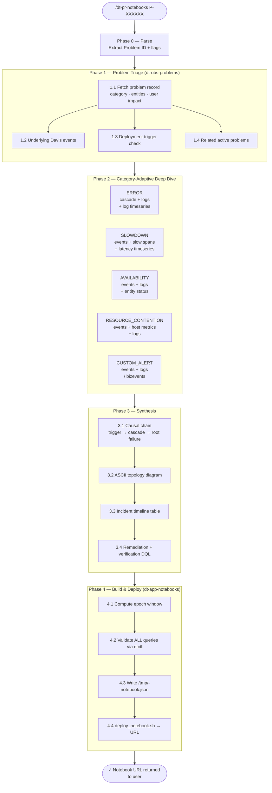

# dt-pr-notebooks

## Status

| Field | Value |
|---|---|
| **Status** | Active |
| **Invoke** | `/dt-pr-notebooks <P-ID>` |
| **License** | Apache-2.0 |
| **Last updated** | 2026-05-27 |

---

## Purpose

Given a Dynatrace Problem ID, diagnose the full root cause from live telemetry and deploy a Dynatrace notebook that walks any SRE through the incident from trigger to fix — executive summary, ASCII topology diagram, incident timeline, step-by-step DQL queries with 3am-ready annotations, and a remediation section with a one-click verification query.

---

## Usage

```
/dt-pr-notebooks P-260530039
/dt-pr-notebooks P-260530039 --title "EasyTrade Trade Failure RCA"
/dt-pr-notebooks P-260530039 --epoch false
/dt-pr-notebooks P-260530039 --title "EasyTrade Trade Failure RCA" --epoch false
```

## Arguments

| Argument | Default | Description |
|---|---|---|
| `P-XXXXXXX` | required | Dynatrace Problem ID (`P-\d+`) |
| `--title "..."` | auto-generated | Override notebook title. Default: `<P-ID> RCA — <event.name> (<ROOT_ENTITY_NAME>)` |
| `--epoch true` | **default** | Pin `defaultTimeframe` and every DQL section to absolute epoch ms. Notebook opens on the exact incident window forever. |
| `--epoch false` | optional | Use `now()-Xh` relative time throughout. Useful for live incidents where the window end is unknown. |

---

## Design

### Execution Phases



### Problem Categories Handled

| Category | Phase 2 queries | Primary signals |
|---|---|---|
| `ERROR` | Error cascade events, root cause logs, log timeseries | `SERVICE_ERROR_RATE_INCREASED` events + ERROR log lines |
| `SLOWDOWN` | Slowdown events, slow spans by p99, latency timeseries | `SERVICE_RESPONSE_TIME_DEGRADED` + span p99 |
| `AVAILABILITY` | Availability events, logs, entity status events | `AVAILABILITY_EVENT` + WARN/ERROR logs |
| `RESOURCE_CONTENTION` | Resource events, host/process metrics, logs | `CPU_SATURATED_EVENT`, `MEMORY_RESOURCES_EXHAUSTED` |
| `CUSTOM_ALERT` | Custom events, logs, business events | `DAVIS_EVENT` + bizevents |

### Entity Type Adaptations

- **MOBILE_APPLICATION** — no k8s workload logs, no `dt.service.request.*` metrics. Uses `MOBILE_APP_CRASH_RATE_INCREASED` and `ERROR_EVENT` event queries instead.
- **K8s workloads** — workload name fragment derived by stripping namespace prefix from ROOT_ENTITY_NAME (e.g., `[eks-live][easytrade] BrokerService` → `broker`).

---

## Features

### 1. Live Telemetry Diagnosis
Queries the tenant in real time — no cached or static data. Every DQL query is validated with `dtctl query --plain` before embedding. Unvalidated queries are never written to the notebook.

### 2. Epoch-Pinned Timeframes (default)
Three layers set consistently so the notebook always opens on the exact incident window:

| Layer | Format | Purpose |
|---|---|---|
| `content.defaultTimeframe` | Epoch ms string (e.g. `"1779816900000"`) | Notebook global time picker default |
| `state.input.timeframe` per section | `{"from": "<MS>", "to": "<MS>"}` | Overrides per-section; prevents fallback to `now()-2h` |
| DQL `from:/to:` in each query | `from:toTimestamp("ISO"), to:toTimestamp("ISO")` | Both required — omitting `to:` silently defaults to `now()` |

**Named exceptions (always relative, regardless of `--epoch` flag):**

| Section | Time filter | Reason |
|---|---|---|
| Davis problem record (§3) | `from:now()-24h` | Davis requires relative bounds; absolute timestamps on `dt.davis.problems` are unreliable |
| Related active problems (§12) | `from:now()-24h` | Live state — must show currently active problems, not historic |
| Verification query (§14) | `from:now()-15m` | Live state — confirms the fix is currently holding |

Exception sections omit `state.input.timeframe`; their relative bounds are carried in the DQL only.

### 3. ASCII Topology Diagram
Box-and-arrow diagram built from actual entity names and IDs in the telemetry data. Shows trigger → root entity → affected entities → user impact. Cascades top-to-bottom, trigger at bottom.

### 4. Concrete Root Failure Mechanism
`ROOT_FAILURE_MECHANISM` must be a specific technical statement, not a vague category.
- Bad: "service errors occurred"
- Good: "SQL Error 544 — IDENTITY_INSERT is OFF on table Trades; every INSERT from BrokerService is rejected by MSSQL"

### 5. Deployment Trigger Detection
Checks for `CUSTOM_DEPLOYMENT` events in the 4-hour window before `PROBLEM_START`. If found within 30 minutes: adds a dedicated deployment section to the notebook and sets `DEPLOYMENT_TRIGGER = true` in the causal chain.

### 6. One-Click Verification Query
Section 14 is a DQL `[dql]` section (never a markdown code fence) that returns 0 records when the fix has been applied. Zero records from the deploy validator is expected and normal — the deploy script warns but does not block.

---

## Notebook Structure

| # | Type | Title | Notes |
|---|---|---|---|
| 1 | markdown | Executive Summary | Diagram + timeline + how-to guide |
| 2 | markdown | Step 1 — Davis Problem Record | Annotation |
| 3 | dql | Davis Problem Record — `<P-ID>` | Exception: `from:now()-24h` |
| 4 | markdown | Step 2 — Deployment / Change Trigger | Skipped if no deployment found |
| 5 | dql | Deployment Events Near Problem Start | Skipped if no deployment found |
| 6 | markdown | Step 3 — Cascade | Annotation |
| 7 | dql | Cascade Events — `<ROOT_ENTITY_NAME>` | Epoch-pinned |
| 8 | dql | `<metric>` Over Time | areaChart, epoch-pinned |
| 9 | markdown | Step 4 — Root Cause Detail | Annotation |
| 10 | dql | Root Cause Logs / Spans — `<ROOT_ENTITY_NAME>` | Epoch-pinned |
| 11 | markdown | Step 5 — Blast Radius & User Impact | Annotation |
| 12 | dql | Active Problems — Blast Radius | Exception: `from:now()-24h` |
| 13 | markdown | Remediation | P1 actions + root fix (no DQL fences) |
| 14 | dql | Verification — Zero `<failure>` Confirms Fix | Exception: `from:now()-15m` |

---

## Skills Composed

| Skill | Role |
|---|---|
| `dt-obs-problems` | Problem schema, field names, query patterns |
| `dt-dql-essentials` | DQL syntax, `makeTimeseries` vs `timeseries`, field escaping |
| `dt-obs-logs` | Log queries for ERROR/AVAILABILITY categories |
| `dt-obs-tracing` | Span queries for SLOWDOWN category |
| `dt-app-notebooks` | Notebook JSON schema, `deploy_notebook.sh` |

**Excluded by design:** `dt-rca`, `dt-rcf`

---

## Example Output

```
✓ Problem fetched: P-260530039 — Failure rate increase
✓ Root cause: [eks-live][easytrade] TradeManagement (ERROR, 92 users)
✓ Trigger: EasyTrade 1.1.1 deployment at 18:00:24 UTC (4 min before first error)
✓ Root failure: SQL Error 544 — IDENTITY_INSERT OFF on Trades table
✓ Epoch window: 2026-05-26T17:35:00Z → 2026-05-26T19:02:00Z (1779816900000 → 1779822120000)
✓ 7/7 DQL queries validated
✓ Notebook deployed: https://demo.apps.dynatrace.com/ui/apps/dynatrace.notebooks/notebook/<id>
```

---

## Changelog

| Date | Change |
|---|---|
| 2026-05-26 | Initial implementation — built from P-260530039 RCA session |
| 2026-05-27 | Added `--epoch` flag (default: true); three-layer timeframe rules; named exceptions for Davis and verification queries; `from:` must always pair with `to:`; `state.input.timeframe` is the controlling layer in notebooks |
