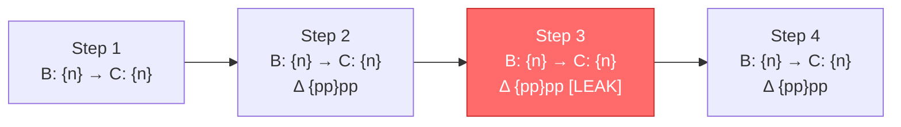

# dt-rum-journey — User Journey Funnel Diff

Agentic Tier-2 skill. Accepts a RUM app, an ordered step list, and two time windows; runs
three parallel workers (funnel counts, leak detection, backend attribution); synthesizes
per-step deltas; passes the funnel diff to Davis CoPilot for cause-class classification;
emits an executive Markdown report (PDF optional, opt-in via `--pdf`).

This skill follows the substrate of `dt-rcf` (parallel reference-driven workers + Phase 0-auth
pre-warm + Absence-Gate + Davis CoPilot synthesis) and the report rules of `dt-rca`
(sanitization, Mermaid-in-MD-only, ASCII-in-PDF). Read those two skills' canonical sections
before maintenance edits here.

---

## Usage

```
/dt-rum-journey APP:"checkout-web" STEPS:"View Cart>Begin Checkout>Enter Payment>Place Order" \
                BASELINE:"2026-05-20T14:00Z..2026-05-20T18:00Z" \
                COMPARE:"2026-05-27T14:00Z..2026-05-27T18:00Z"

/dt-rum-journey APP:"shop-mobile" STEPS:"/products>/cart>/checkout>/confirmation" \
                --vs-deploy DEPLOY-7C3A8B91

/dt-rum-journey APP:"signup-web" STEPS:"/signup>/verify-email>/welcome" \
                BASELINE:"2026-05-21T00:00Z..2026-05-22T00:00Z" \
                COMPARE:"2026-05-27T00:00Z..2026-05-28T00:00Z" -clean

/dt-rum-journey APP:"checkout-web" STEPS:"Add To Cart>Begin Checkout>Place Order" \
                --vs-deploy DEPLOY-7C3A8B91 -clean

/dt-rum-journey APP:"checkout-web" STEPS:"View Cart>Begin Checkout>Place Order" \
                BASELINE:"2026-05-20T14:00Z..2026-05-20T18:00Z" \
                COMPARE:"2026-05-27T14:00Z..2026-05-27T18:00Z" --pdf   # also render a PDF
```

**Output is Markdown by default.** Pass `--pdf` to additionally render a PDF (opt-in; never
blocks or fails a run — a missing PDF engine logs one line and the Markdown still ships).

## Arguments

- `APP:"<rum-app-id-or-frontend-name>"` — required. Matches `frontend.name` in RUM data.
- `STEPS:"step1>step2>...>stepN"` — required. 2–7 ordered steps separated by `>`.
- `BASELINE:"<iso>..<iso>"` — pre-incident / pre-change window (UTC ISO-8601).
- `COMPARE:"<iso>..<iso>"` — post-incident / post-change window (UTC ISO-8601).
- `--vs-deploy DEPLOY-<id>` — alternative to BASELINE/COMPARE: derives both windows from the
  deploy event timestamp (BASELINE = 4h before deploy, COMPARE = 4h after deploy).
- `-clean` — sanitize URLs, page names, frontend names, user tags, and any IP/geo identifiers
  per dt-rca Phase 1.14 rules.
- `--pdf` — **opt-in**, default OFF. Also render a PDF alongside the Markdown. Never blocks or
  fails a run: if the PDF engine is unavailable, the skill logs one line and ships the Markdown.
  Legacy alias `pdf=true` is accepted; `pdf=false` is a no-op. Markdown is the canonical
  deliverable.

### STEPS parsing rule (document this in the report so the user can verify)

Each step is parsed by leading character:

| Leading char | Match rule | DQL predicate |
|---|---|---|
| `/` | URL path match | `page.url.path == "<step>"` on `characteristics.has_page_summary == true` events |
| any other | UserAction name match | `interaction.name == "<step>"` on `characteristics.has_user_action == true` events (verified on tenant 2026-05-28; `user_action.name` is not populated on this tenant family — `interaction.name` is the canonical field) |

Mixed step lists are allowed (e.g. `Add To Cart>/cart>Place Order`). Each step is evaluated
independently against its event type.

---

## Sub-Skills Loaded Per Phase

dt-rum-journey carries NO inline DQL beyond the orchestration primitives below. Each worker
reads ONE targeted reference at start, ONCE per subagent, then derives queries.

| Worker | Reference files (read ONCE at worker start) |
|---|---|
| W-funnel | `~/.claude/skills/dt-obs-frontends/SKILL.md` + `references/UserAction.md` + `references/PageViewAnalysis.md` + `references/user-sessions.md` |
| W-dropoff | `~/.claude/skills/dt-obs-frontends/references/NavigationPatterns.md` + `references/UserAction.md` |
| W-attribution | `~/.claude/skills/dt-obs-tracing/references/request-attributes.md` + `references/entity-lookups.md` |

**Sanitization, URL format, Mermaid/ASCII diagram rules, and PDF generation:** identical to
`/dt-rca` — read `~/.claude/skills/dt-rca/SKILL.md` sections "Phase 1.14", "Phase 3",
"Phase 4", "PDF DIAGRAM RULES", "MERMAID SYNTAX RULES", and "DIAGRAM SIZING RULES". All apply
unchanged.

---

## ENTITY MODEL & RUM Data Source Rules (NON-NEGOTIABLE)

- RUM events: `fetch user.events` — filter by `frontend.name == "{APP}"`.
- RUM sessions: `fetch user.sessions` — note dot-vs-underscore field-naming gotcha (see
  `dt-obs-frontends/SKILL.md` › "Session Data"). Use **`dt.rum.session.id`** (NOT
  `dt.rum.session_id`).
- Session correlation: **`dt.rum.session.id`** uniquely identifies a session; **`dt.rum.user_tag`**
  (when set by `dtrum.identifyUser()` in the instrumented frontend) identifies a logged-in user
  and may be empty. Fall back to `dt.rum.instance.id` (random device-side ID) when `user_tag`
  is null.
- Time-window quirk: `fetch user.sessions, from:X, to:Y` returns sessions that **started** in
  `[X, Y]` — not active during. For correlation, extend lookback by at least 8h. For event
  correlation, also exclude the last ~1h to avoid in-progress sessions (no `user.sessions`
  record yet) being miscounted as orphans.
- Real-user filter: ALWAYS apply `filter dt.rum.user_type == "real_user"` to remove synthetic
  and robot traffic from funnel counts. State this filter explicitly in the report.
- Backend correlation: spans carry **`dt.rum.trace_id`** when RUM injected a trace header.
  Workers MUST use `dt.rum.session.id` (RUM side) ⨯ `dt.rum.trace_id` (span side) to bridge —
  not classic entity selectors.

---

## EXECUTION PROTOCOL

### Run logging (async, non-blocking — set up at the very start)

Set `LOG="RUMJOURNEY_{APP_SLUG}_{DATE}.log"` next to the report. At each phase boundary append
ONE line backgrounded so it never gates execution:
```bash
{ printf '[%s] %s\n' "$(date -u +%FT%TZ)" "Phase X — <one-line summary>" >> "$LOG"; } &
```
Log: START, Phase 0b complete (StepContext summary), Phase 1 dispatch (3 workers), each worker
return summary, Absence-Gate result, Davis CoPilot returned, report written, RUN COMPLETE.

---

### Phase 0-auth: PRE-WARM the dtctl session (Orchestrator)

**FIRST action of the whole run — before any DQL and before any dispatch:**
```
dtctl auth refresh
```
Silent refresh of the on-disk token (`DTCTL_TOKEN_STORAGE=file`); never prompts a browser.
This guarantees workers inherit one fresh token instead of racing concurrent refreshes.

- `dtctl auth refresh` succeeds → token fresh; proceed to Phase 0b.
- Fails (no/expired refresh token) → ONLY then: `dtctl auth login --plain --safety-level readonly`
  (one-time, read-only scopes). Workers NEVER authenticate; if a worker returns `<gap: auth>`,
  orchestrator refreshes once and re-dispatches only that worker.

> **AUTH HARDENING (NON-NEGOTIABLE — added 2026-06-03):**
> - **Workers NEVER run `dtctl auth login` OR `dtctl auth refresh`.** On any auth-shaped error a worker returns `<gap: auth>` and STOPS immediately. Authentication is exclusively the orchestrator's job, done serially — never inside a subagent.
> - **The orchestrator runs `dtctl auth login` at most ONCE per run, and ONLY as an interactive browser flow.** NEVER spawn it from a subagent, in the background, or in parallel. Concurrent / non-interactive `dtctl auth login` attempts corrupt the on-disk token store (observed 2026-06-03: the `demo` context OAuth session was wiped and flipped to a missing "platform token", blocking every query).
> - If `dtctl auth refresh` fails AND an interactive login cannot be completed in the current context (headless / subagent / automation), the orchestrator **STOPS with an "Auth unavailable" banner** and surfaces it to the user. It does NOT retry logins in a loop and NEVER lets workers attempt recovery.

---

### Phase 0a: Argument Parser

```
APP            = APP:"..." token (required)
STEPS_RAW      = STEPS:"step1>step2>..." (required)
STEPS[]        = split STEPS_RAW on ">"; trim each; preserve order
STEP_KIND[i]   = "url" if STEPS[i].startsWith("/") else "action"

BASELINE_FROM, BASELINE_TO   = parse BASELINE:"<iso>..<iso>"   (one path)
COMPARE_FROM, COMPARE_TO     = parse COMPARE:"<iso>..<iso>"    (one path)

DEPLOY_ID      = --vs-deploy DEPLOY-... (alt path; resolves windows in Phase 0b)

FLAGS:
  -clean       → CLEAN_MODE = true
  appendix     → FULL_APPENDIX = true (default false)
  --pdf        → PDF_MODE = true   (default FALSE — Markdown is the canonical deliverable)
  pdf=true     → PDF_MODE = true   (legacy alias for --pdf)
  pdf=false    → no-op (explicit MD-only; PDF_MODE stays false)

VALIDATION:
  - len(STEPS) >= 2  → else "a funnel needs ≥2 steps; got {n}" and exit
  - len(STEPS) <= 7  → else "more than 7 steps is unmanageable; split into sub-funnels" and exit
  - APP present      → else print usage and exit
  - exactly one of (BASELINE+COMPARE) or (--vs-deploy) → else "pick one window source" and exit
  - all STEPS non-empty
```

---

### Phase 0b: Bootstrap (Sequential — Orchestrator)

Build the **StepContext** that all workers receive. Keep this minimal. Single quotes around
every dtctl DQL arg.

---

#### Phase 0b.0 — Substrate Probe (run ONCE, before Q1–Q3)

**Why:** funnel-step names drift. The `interaction.name` / `page.url.path` vocabulary present in
the live window is the ground truth — a STEPS list that names interactions which no longer fire
produces a false "severe leak" (near-zero sessions at an *absent* step, not a real drop-off).
This probe surfaces the REAL step vocabulary up front so the operator/orchestrator can pick valid
steps instead of failing silently on absent ones. It does NOT exit — it informs and warns.

Run these **two cheap discovery queries** (parallel-batchable):

**P-1 — Top real UserAction names (`interaction.name`) in the window** — the canonical
action-step vocabulary:

<!-- VALIDATED LIVE on tenant demo 2026-06-03 — APP:"EasyTrade" returns interaction.name="click" (64,351 events / 9,345 sessions) as the ONLY named action; a large null-name bucket is page-load/navigation noise (filter it out). user_action.name / useraction.type / key.name are NOT populated — interaction.name is canonical. -->
```dql
fetch user.events, from:toTimestamp("{BASELINE_FROM}"), to:toTimestamp("{COMPARE_TO}")
| filter frontend.name == "{APP}"
| filter dt.rum.user_type == "real_user"
| filter characteristics.has_user_action == true
| filter isNotNull(interaction.name)
| summarize sessions = countDistinct(dt.rum.session.id), action_count = count(), by: {interaction.name}
| sort action_count desc
| limit 10
```
(If `--vs-deploy` and the windows are not yet resolved at probe time, use `from:now()-24h`.)

**P-2 — Top real page paths (`page.url.path`) in the window** — the canonical url-step
vocabulary:

<!-- VALIDATED LIVE on tenant demo 2026-06-03 — APP:"EasyTrade" page summaries collapse to page.url.path="/" only (SPA / client-side routing → distinct views do NOT get distinct paths). URL-kind steps other than "/" will read zero on this RUM family. -->
```dql
fetch user.events, from:toTimestamp("{BASELINE_FROM}"), to:toTimestamp("{COMPARE_TO}")
| filter frontend.name == "{APP}"
| filter dt.rum.user_type == "real_user"
| filter characteristics.has_page_summary == true
| summarize sessions = countDistinct(dt.rum.session.id), c = count(), by: {page.url.path}
| sort c desc
| limit 10
```

**Bind + emit (no hardcoded literals):**
- `REAL_ACTION_NAMES[]` = ordered list from P-1 (the present action vocabulary).
- `REAL_URL_PATHS[]`    = ordered list from P-2 (the present url vocabulary).
- For each requested STEP: mark `STEP_PRESENT[i] = true` if it appears in the matching vocabulary
  (`REAL_ACTION_NAMES` for action-kind, `REAL_URL_PATHS` for url-kind), else `false`.
- Emit a one-line probe summary to the run log, e.g.
  `Probe: action-names→[click]; url-paths→[/]; requested steps present: [click✓, View Cart✗, Place Order✗]`.
- **Surface `REAL_ACTION_NAMES` / `REAL_URL_PATHS` in the report header** (a short "Step
  vocabulary discovered live" note) so the reader can see which steps were real vs. absent.
- This is the **CANDIDATE LIST** the operator should pick from. If the supplied STEPS do not
  intersect the live vocabulary at all, still proceed (Q3 + Phase 1.5 gate absence), but lead the
  report with: *"None of the requested steps match the live step vocabulary
  ({REAL_ACTION_NAMES}/{REAL_URL_PATHS}); the funnel below reflects absent steps — re-run with
  steps drawn from the discovered vocabulary."* Absence stays gated, never assumed.

> SPA caveat: when `REAL_URL_PATHS` collapses to a single root path (e.g. only `/`), client-side
> routing is in play — distinct views are NOT distinguishable by `page.url.path`. Prefer
> action-kind steps from `REAL_ACTION_NAMES`, or treat the journey as single-view and note the
> limitation in the report rather than reporting phantom URL leaks.

---

**Q1 — Resolve APP / frontend entity** (sanity-check the frontend name exists and is active):

<!-- VALIDATED on tenant 2026-05-28 — substrate confirmed (interaction.name canonical, user_action.name not populated on this tenant family) -->
```dql
fetch user.events, from:now()-24h
| filter frontend.name == "{APP}"
| filter dt.rum.user_type == "real_user"
| summarize event_count = count(),
            page_summaries = countIf(characteristics.has_page_summary == true),
            user_actions = countIf(characteristics.has_user_action == true),
            navigations = countIf(characteristics.has_navigation == true)
| limit 1
```
- If `event_count == 0` → "frontend {APP} has no real-user events in last 24h — verify name"
  and exit. Try matching with `contains(frontend.name, "{APP}")` once before exiting.
- Record `APP_RESOLVED = "{APP}"`, `APP_TYPE = web|mobile` (inferred from
  `dt.rum.application.type` if present), `STEP_KIND_AVAILABILITY` (do page_summaries / user_actions
  exist at all — if a STEPS entry is a URL but `page_summaries == 0`, warn).

**Q2 (only if `--vs-deploy`) — Resolve deploy timestamp:**

<!-- VALIDATED on tenant 2026-05-28 — substrate confirmed (interaction.name canonical, user_action.name not populated on this tenant family) -->
```dql
fetch events, from:now()-30d
| filter event.kind == "DEPLOYMENT_EVENT" or event.type == "CUSTOM_DEPLOYMENT"
| filter event.id == "{DEPLOY_ID}" or matchesValue(event.name, "*{DEPLOY_ID}*")
| fields timestamp, event.name, event.type, dt.smartscape_source.id
| sort timestamp desc
| limit 1
```
Derive `BASELINE = [timestamp-4h, timestamp-15m]` and `COMPARE = [timestamp+15m, timestamp+4h+15m]`
(15-min buffer around the deploy boundary to exclude transient deploy-time noise).

**Q3 (optional, only if STEP_KIND contains "action") — Verify UserAction names match:**

<!-- VALIDATED on tenant 2026-05-28 — interaction.name is the canonical UserAction-name field -->
```dql
fetch user.events, from:toTimestamp("{BASELINE_FROM}"), to:toTimestamp("{COMPARE_TO}")
| filter frontend.name == "{APP}"
| filter characteristics.has_user_action == true
| filter dt.rum.user_type == "real_user"
| summarize action_count = count(), by: {interaction.name}
| filter in(interaction.name, array({comma-separated quoted STEPS where kind==action}))
| sort action_count desc
```
For each action-kind step missing from results, note `STEP_MATCH_WARNINGS[i] = "no events found
for action '<step>' — verify naming"` and surface in the report. Do NOT exit — names may differ
case/spacing from the instrumented `interaction.name` value.

> Q3 confirms the per-step match; **Phase 0b.0's `REAL_ACTION_NAMES` is the authoritative
> vocabulary** — if a step is absent there, the `STEP_MATCH_WARNINGS` entry should cite the
> discovered candidate list (e.g. `"action 'View Cart' not in live vocabulary [click] — pick a
> real step"`) so the warning is actionable, not just "verify naming". The two are consistent;
> Q3 may be skipped if Phase 0b.0 already resolved every action-kind step's presence.

Store the **StepContext JSON**:

```json
{
  "APP": "...",
  "APP_TYPE": "web|mobile",
  "STEPS": ["step1","step2","step3","step4"],
  "STEP_KIND": ["action","url","action","url"],
  "BASELINE": { "from": "ISO", "to": "ISO" },
  "COMPARE":  { "from": "ISO", "to": "ISO" },
  "DEPLOY_ID": "DEPLOY-... or null",
  "DEPLOY_TIME": "ISO or null",
  "STEP_MATCH_WARNINGS": [],
  "REAL_ACTION_NAMES": ["click"],
  "REAL_URL_PATHS": ["/"],
  "STEP_PRESENT": [true, false, false],
  "CLEAN_MODE": false,
  "FULL_APPENDIX": false,
  "PDF_MODE": false
}
```

`REAL_ACTION_NAMES` / `REAL_URL_PATHS` come from Phase 0b.0 and are passed to every worker —
they are the live step vocabulary, not a hardcoded assumption. (Example values shown above are
the live `APP:"EasyTrade"` result on tenant `demo` 2026-06-03: action vocabulary = `[click]`,
url vocabulary = `[/]` — a SPA with a single root path.)

---

### Phase 0c: Reference Strategy

dt-rum-journey is **reference-driven**. Each worker reads ONE targeted reference (its authority)
at start, ONCE per subagent, then derives queries from it and applies the dt-rum-journey scoping
below. Orchestrator inline DQL is restricted to Phase 0b bootstrap and Phase 1.5 Absence-Gate
confirmations.

Proceed from Phase 0b to Phase 1.

---

### Phase 1: Parallel Worker Dispatch

> **PRE-DISPATCH REALITY GATE (NON-NEGOTIABLE — added 2026-06-03):** Before dispatching ANY worker,
> confirm the Phase 0b bootstrap (and Phase 0b.0 probe) actually executed at least one SUCCESSFUL
> `dtctl query` that returned real data (rows, or a deliberate proven-zero) — NOT an `{ok:false}`
> error envelope, NOT an auth failure, NOT an unrun query. If the bootstrap could not execute a
> single successful query (dead auth, connection error, or every bootstrap query errored), **STOP
> HERE — do NOT fan out workers.** Emit the skill's auth/substrate-unreachable error banner (see
> ERROR HANDLING) and exit. Dispatching workers into a dead substrate is exactly what produces
> fabricated findings — a run that stops with a clear "could not reach the tenant" banner is
> correct; a run that fans out workers with no working auth invites confabulation. (The Phase 0b
> bootstrap queries are the proof — if they returned data, auth is live and dispatch is safe.)

**Dispatch ALL THREE workers in ONE message with multiple Agent calls — true concurrency.**
Sequential dispatch (send, wait, send) defeats the architecture.

Workers: `W-funnel`, `W-dropoff`, `W-attribution`. All three run concurrently as
`subagent_type: Explore`.

**Worker-failure handling:** if a worker returns gaps or fails, **re-dispatch that ONE worker
ONCE** as a fresh Agent call — never run its queries inline in the orchestrator. If it still
fails, record `gap` and continue.

#### Worker Prompt Template

```
You are a worker for dt-rum-journey (RUM Funnel Diff).

ANTI-FABRICATION (READ FIRST — non-negotiable):
If your dtctl queries return no usable data — an auth error, an `{ok:false}` error envelope, an
empty result, or no successfully-executed query at all — you have NOTHING to report. Return your
gap marker (`<gap: ...>`) and STOP. NEVER write a metric, count, latency, rate, or ANY number you
did not read directly from a successful query result. Inventing plausible-looking numbers is the
single worst failure mode of this skill: a `<gap>` is always correct and safe; a fabricated number
is never acceptable. If you cannot point to the query result a number came from, do not emit it.

STEP 1 — READ YOUR REFERENCE (first action, before any query):
Read the reference files in REFERENCE FILES below, ONCE each. Take the query patterns from
them; apply the STEP CONTEXT scoping rules. This is the ONLY source of DQL truth.

STEP 2 — RUN ALL QUERIES IN ONE PARALLEL BATCH:
Issue ALL independent queries in ONE message (multiple `dtctl query` tool calls).

RUM SCOPING — CRITICAL:
- ALWAYS filter dt.rum.user_type == "real_user" — synthetic + robot traffic distorts funnels.
- ALWAYS filter frontend.name == "{APP}" (StepContext.APP).
- For SESSIONS: extend the from: lookback by 8h vs the event window (sessions can last 8h+).
- For ORPHAN-AVOIDANCE: when correlating events to sessions, exclude the last 1h
  (recent sessions have no user.sessions record yet — by design).
- `dt.rum.session.id` (with dot) — never `dt.rum.session_id`.
- Backend bridge: spans carry `dt.rum.trace_id` and `dt.rum.session.id`.

STEP CONTEXT:
{STEP_CONTEXT_JSON}

QUERIES TO RUN:
{QUERY_INSTRUCTIONS_FOR_THIS_WORKER}

RULES:
- Run all independent queries in parallel (multiple tool calls per message).
- Do NOT return raw rows — internalize and summarize aggressively.
- Cap PhaseResult at ~4KB. Top-5 of anything, not top-50.
- If a query fails with a SYNTAX/FIELD error, retry ONCE with corrected syntax.
- AUTH IS THE ORCHESTRATOR'S JOB — workers NEVER run `dtctl auth login` OR `dtctl auth refresh`.
  If you see an auth error AND your dtctl calls already have `DTCTL_TOKEN_STORAGE=file` prefix,
  return `<gap: auth>` and STOP — never attempt any auth recovery.
- ERROR ≠ ABSENCE. A scoped 0-row result usually means the filter was wrong. Before reporting
  "step never reached", run an UNFILTERED confirmation (no step filter, just frontend+window).
- PROOF OF ABSENCE: if you conclude a step was never reached, include the exact unfiltered
  confirmation query + zero-row result in your PhaseResult.
- DQL execution: `DTCTL_TOKEN_STORAGE=file dtctl query '<dql>'` — SINGLE QUOTES around the
  DQL. No backticks (alias bins: `ts = bin(start_time, 15m) | sort ts asc`).

RETURN only this PhaseResult shape (JSON). Nothing else.
{PHASE_RESULT_SCHEMA}
```

---

#### W-funnel — Per-step session counts + conversion

**REFERENCE-DRIVEN.** Read `~/.claude/skills/dt-obs-frontends/SKILL.md` ›
"Event Characteristics" + "Session Data", `references/PageViewAnalysis.md` ›
"Page Views Overview", `references/UserAction.md` › "User Action Overview" and
"Actions by Interaction", `references/user-sessions.md` › "Core Session Metrics". Take the
patterns; apply the scoping below.

**Scoping/hygiene for EVERY query:**
- `filter frontend.name == "{APP}"`
- `filter dt.rum.user_type == "real_user"`
- For each step `S_i`:
  - if `STEP_KIND[i] == "url"`: `filter characteristics.has_page_summary == true and page.url.path == "{S_i}"`
  - if `STEP_KIND[i] == "action"`: `filter characteristics.has_user_action == true and interaction.name == "{S_i}"` (verified on tenant 2026-05-28; `user_action.name` is not populated on this tenant family — `interaction.name` is the canonical field)
- Session count for step `S_i` = `countDistinct(dt.rum.session.id)` over the window restricted
  to that step's predicate.

**Queries to run (ALL in one parallel batch):**

For each window W in [BASELINE, COMPARE]:

1. **Per-step distinct session count** (one query per step per window — parallel-batchable):

<!-- VALIDATED on tenant 2026-05-28 — substrate confirmed (interaction.name canonical, user_action.name not populated on this tenant family) -->
```dql
fetch user.events, from:toTimestamp("{W.from}"), to:toTimestamp("{W.to}")
| filter frontend.name == "{APP}"
| filter dt.rum.user_type == "real_user"
| filter {step_predicate_S_i}
| summarize sessions_at_step = countDistinct(dt.rum.session.id)
```

2. **Total funnel-entry sessions** (sessions that reached step 1 only — denominator for end-to-end
   conversion):

<!-- VALIDATED on tenant 2026-05-28 — substrate confirmed (interaction.name canonical, user_action.name not populated on this tenant family) -->
```dql
fetch user.events, from:toTimestamp("{W.from}"), to:toTimestamp("{W.to}")
| filter frontend.name == "{APP}"
| filter dt.rum.user_type == "real_user"
| filter {step_predicate_S_1}
| summarize sessions_entered = countDistinct(dt.rum.session.id)
```

3. **Strict-ordering sanity** (best-effort — confirm a non-trivial number of sessions reach
   each later step AFTER reaching step 1, not in parallel). For each step `S_i` (i ≥ 2):

<!-- VALIDATED on tenant 2026-05-28 — substrate confirmed (interaction.name canonical, user_action.name not populated on this tenant family) -->
```dql
fetch user.events, from:toTimestamp("{W.from}"), to:toTimestamp("{W.to}")
| filter frontend.name == "{APP}"
| filter dt.rum.user_type == "real_user"
| filter {step_predicate_S_i}
| summarize earliest_at_step_i = min(start_time), by: {dt.rum.session.id}
| join [
    fetch user.events, from:toTimestamp("{W.from}"), to:toTimestamp("{W.to}")
    | filter frontend.name == "{APP}"
    | filter dt.rum.user_type == "real_user"
    | filter {step_predicate_S_1}
    | summarize earliest_at_step_1 = min(start_time), by: {dt.rum.session.id}
  ], on:{dt.rum.session.id}, fields:{earliest_at_step_1}
| filter earliest_at_step_i >= earliest_at_step_1
| summarize ordered_sessions = countDistinct(dt.rum.session.id)
```

Compute and report (in PhaseResult):
- `sessions[step_i][window]` raw count
- `step_over_step_conversion[i][window]` = `sessions[i] / sessions[i-1]` (NOT `/ sessions[1]`)
- `end_to_end_conversion[window]` = `sessions[N] / sessions[1]`
- `delta_pp[i]` = COMPARE step-over-step conv − BASELINE step-over-step conv (in **percentage
  points**, signed)

**PhaseResult shape:**
```json
{
  "window_baseline": { "from": "ISO", "to": "ISO" },
  "window_compare":  { "from": "ISO", "to": "ISO" },
  "steps": [
    {
      "index": 1,
      "step": "...",
      "kind": "url|action",
      "sessions_baseline": 0,
      "sessions_compare": 0,
      "sov_conv_baseline_pct": null,
      "sov_conv_compare_pct": null,
      "delta_pp": null
    }
  ],
  "end_to_end_conv_baseline_pct": 0,
  "end_to_end_conv_compare_pct": 0,
  "end_to_end_delta_pp": 0,
  "biggest_leak_step_index": 0,
  "biggest_leak_delta_pp": 0,
  "ordering_sanity_notes": [],
  "gaps": []
}
```

---

#### W-dropoff — What did leakers do instead?

**REFERENCE-DRIVEN.** Read `~/.claude/skills/dt-obs-frontends/references/NavigationPatterns.md` ›
"Internal Navigation Flows" + "Page Reload Analysis" and `references/UserAction.md` ›
"Interrupted Actions" + "Timed-Out Actions". Apply the dt-rum-journey scoping.

**W-funnel runs first in elapsed time but we dispatch in parallel — so this worker takes the
StepContext, computes the leak point itself, and proceeds. Use the heuristic: leak point =
the step `i` (1 ≤ i < N) where `delta_pp[i]` will be most negative based on independent
recomputation. To avoid duplicating W-funnel exactly, this worker fetches only the COMPARE
window step counts and uses them to confirm direction.**

**For each step `S_i` where W-funnel's `delta_pp[i] <= -5`** (leak threshold; if W-funnel has
not yet returned by dispatch time, recompute step counts here for COMPARE only and identify
the largest step-over-step drop):

1. **Next action / page after dropping at S_i** — for sessions that reached `S_i` in COMPARE
   but did NOT reach `S_{i+1}`, what was their next user_action or page_summary event?

<!-- VALIDATED on tenant 2026-05-28 — substrate confirmed (interaction.name canonical, user_action.name not populated on this tenant family) -->
```dql
fetch user.events, from:toTimestamp("{COMPARE.from}"), to:toTimestamp("{COMPARE.to}")
| filter frontend.name == "{APP}"
| filter dt.rum.user_type == "real_user"
| filter {step_predicate_S_i}
| summarize step_i_time = min(start_time), by: {dt.rum.session.id}
| join [
    fetch user.events, from:toTimestamp("{COMPARE.from}"), to:toTimestamp("{COMPARE.to}")
    | filter frontend.name == "{APP}"
    | filter dt.rum.user_type == "real_user"
    | filter {step_predicate_S_next}
    | summarize step_next_time = min(start_time), by: {dt.rum.session.id}
  ], on:{dt.rum.session.id}, kind:left_outer, fields:{step_next_time}
| filter isNull(step_next_time)
| join [
    fetch user.events, from:toTimestamp("{COMPARE.from}"), to:toTimestamp("{COMPARE.to}")
    | filter frontend.name == "{APP}"
    | filter dt.rum.user_type == "real_user"
    | filter characteristics.has_user_action == true or characteristics.has_page_summary == true or characteristics.has_navigation == true
    | fields dt.rum.session.id, start_time, page.url.path, interaction.name, navigation.type
  ], on:{dt.rum.session.id}, fields:{start_time, page.url.path, interaction.name, navigation.type}
| filter start_time > step_i_time
| summarize earliest_next = min(start_time), by: {dt.rum.session.id, page.url.path, interaction.name, navigation.type}
| summarize sessions = countDistinct(dt.rum.session.id),
            by: {next_action = coalesce(interaction.name, page.url.path)}
| sort sessions desc
| limit 10
```

2. **Session-end reason for leakers** — did they bounce, time out, navigate away externally,
   or just go idle?

<!-- VALIDATED on tenant 2026-05-28 — substrate confirmed (interaction.name canonical, user_action.name not populated on this tenant family) -->
```dql
fetch user.sessions, from:toTimestamp("{COMPARE.from}")-8h, to:toTimestamp("{COMPARE.to}")
| filter contains(frontend.name, "{APP}")
| filter dt.rum.user_type == "real_user"
| filter dt.rum.session.id in [
    fetch user.events, from:toTimestamp("{COMPARE.from}"), to:toTimestamp("{COMPARE.to}")
    | filter frontend.name == "{APP}"
    | filter {step_predicate_S_i}
    | fields dt.rum.session.id
  ]
| filter not(dt.rum.session.id in [
    fetch user.events, from:toTimestamp("{COMPARE.from}"), to:toTimestamp("{COMPARE.to}")
    | filter frontend.name == "{APP}"
    | filter {step_predicate_S_next}
    | fields dt.rum.session.id
  ])
| summarize sessions = count(),
            bounces = countIf(characteristics.is_bounce == true),
            avg_duration_s = avg(toLong(duration)) / 1000000000,
            by: {end_reason}
| sort sessions desc
| limit 10
```

3. **Interrupted/timed-out user actions AT the leak step** (per `UserAction.md` › "Interrupted
   Actions" + "Timed-Out Actions"):

<!-- VALIDATED on tenant 2026-05-28 — substrate confirmed (interaction.name canonical, user_action.name not populated on this tenant family) -->
```dql
fetch user.events, from:toTimestamp("{COMPARE.from}"), to:toTimestamp("{COMPARE.to}")
| filter frontend.name == "{APP}"
| filter dt.rum.user_type == "real_user"
| filter {step_predicate_S_i}
| summarize action_count = count(),
            by: {user_action.complete_reason}
| sort action_count desc
```

**PhaseResult shape:**
```json
{
  "leak_step_index": 0,
  "leak_step_name": "...",
  "leaker_sessions": 0,
  "top_next_actions": [{ "next_action": "...", "sessions": 0, "pct_of_leakers": 0 }],
  "end_reason_breakdown": [{ "end_reason": "...", "sessions": 0, "bounces": 0, "avg_duration_s": 0 }],
  "complete_reason_at_step": [{ "reason": "completed|timeout|interrupted_by_navigation|...", "count": 0 }],
  "interpretation_hint": "ux_regression | backend_error | abandonment | nav_redirect",
  "gaps": []
}
```

---

#### W-attribution — Backend correlation for leakers

**REFERENCE-DRIVEN.** Read `~/.claude/skills/dt-obs-tracing/references/request-attributes.md`
(for `dt.rum.session.id` and `dt.rum.trace_id` on spans) and `references/entity-lookups.md`
(for `getNodeName(dt.smartscape.service)` on spans). Apply dt-rum-journey scoping.

**Goal:** for the leak step `S_i`, determine whether sessions that dropped saw a backend error
(span failure / 5xx / exception) during the leak window — vs sessions that progressed
successfully through to `S_{i+1}`.

**Queries to run (ALL in one parallel batch):**

1. **Failed spans correlated to leaker session IDs in COMPARE window** (the leaker
   `dt.rum.session.id` set is supplied as an inline array OR re-derived via subquery):

<!-- VALIDATED on tenant 2026-05-28 — substrate confirmed (interaction.name canonical, user_action.name not populated on this tenant family) -->
```dql
fetch spans, from:toTimestamp("{COMPARE.from}"), to:toTimestamp("{COMPARE.to}")
| filter dt.rum.session.id in [
    fetch user.events, from:toTimestamp("{COMPARE.from}"), to:toTimestamp("{COMPARE.to}")
    | filter frontend.name == "{APP}"
    | filter dt.rum.user_type == "real_user"
    | filter {step_predicate_S_i}
    | fields dt.rum.session.id
  ]
| filter not(dt.rum.session.id in [
    fetch user.events, from:toTimestamp("{COMPARE.from}"), to:toTimestamp("{COMPARE.to}")
    | filter frontend.name == "{APP}"
    | filter dt.rum.user_type == "real_user"
    | filter {step_predicate_S_next}
    | fields dt.rum.session.id
  ])
| filter request.is_failed == true or http.response.status_code >= 500
| fieldsAdd service_name = getNodeName(dt.smartscape.service)
| summarize fail_count = count(),
            by: {service_name, endpoint.name, http.response.status_code}
| sort fail_count desc
| limit 15
```

2. **Same query restricted to PROGRESSORS** (sessions that reached BOTH `S_i` and `S_{i+1}`)
   — to compute the differential failure rate:

<!-- VALIDATED on tenant 2026-05-28 — substrate confirmed (interaction.name canonical, user_action.name not populated on this tenant family) -->
```dql
fetch spans, from:toTimestamp("{COMPARE.from}"), to:toTimestamp("{COMPARE.to}")
| filter dt.rum.session.id in [
    fetch user.events, from:toTimestamp("{COMPARE.from}"), to:toTimestamp("{COMPARE.to}")
    | filter frontend.name == "{APP}"
    | filter dt.rum.user_type == "real_user"
    | filter {step_predicate_S_next}
    | fields dt.rum.session.id
  ]
| filter request.is_failed == true or http.response.status_code >= 500
| fieldsAdd service_name = getNodeName(dt.smartscape.service)
| summarize fail_count = count(),
            by: {service_name, endpoint.name, http.response.status_code}
| sort fail_count desc
| limit 15
```

3. **RUM-side errors at leak step** (XHR/fetch failures, JS exceptions seen client-side during
   the leak window):

<!-- VALIDATED on tenant 2026-05-28 — substrate confirmed (interaction.name canonical, user_action.name not populated on this tenant family) -->
```dql
fetch user.events, from:toTimestamp("{COMPARE.from}"), to:toTimestamp("{COMPARE.to}")
| filter frontend.name == "{APP}"
| filter dt.rum.user_type == "real_user"
| filter characteristics.has_error == true
| filter dt.rum.session.id in [
    fetch user.events, from:toTimestamp("{COMPARE.from}"), to:toTimestamp("{COMPARE.to}")
    | filter frontend.name == "{APP}"
    | filter dt.rum.user_type == "real_user"
    | filter {step_predicate_S_i}
    | fields dt.rum.session.id
  ]
| summarize error_count = count(),
            sessions_affected = countDistinct(dt.rum.session.id),
            by: {error.type, error.name, http.response.status_code, url.path}
| sort error_count desc
| limit 15
```

**Differential rule:** if `leaker_fail_rate / progressor_fail_rate > 2.0` for any
(service, endpoint, status) tuple, classify as `backend_attributed`. Otherwise
`no_backend_correlation` (UX/content/pricing/abandonment cause — Davis CoPilot picks the
specific class in Phase 3).

**PhaseResult shape:**
```json
{
  "leaker_session_count": 0,
  "progressor_session_count": 0,
  "leaker_backend_failures": [{ "service": "...", "endpoint": "...", "status": 0, "fail_count": 0 }],
  "progressor_backend_failures": [{ "service": "...", "endpoint": "...", "status": 0, "fail_count": 0 }],
  "leaker_rum_errors": [{ "type": "...", "name": "...", "status": 0, "url": "...", "count": 0, "sessions": 0 }],
  "differential_attribution": [
    { "service": "...", "endpoint": "...", "status": 0, "leaker_rate": 0.0, "progressor_rate": 0.0, "ratio": 0.0, "verdict": "backend_attributed|no_correlation" }
  ],
  "overall_verdict": "backend_attributed | no_backend_correlation",
  "gaps": []
}
```

---

### Phase 1.5: Absence Gate (Orchestrator — run before trusting any "absent" finding)

Scan every PhaseResult for absence claims ("no events at step X", "no backend errors found",
"step never reached"). For each:

1. Require the worker's **proof** (unfiltered confirmation query + zero-row result). If missing,
   the claim is invalid.
2. Run ONE cheap unfiltered confirmation query yourself:
   - For "no events at step X" with `STEP_KIND == "action"`:
     <!-- VALIDATED on tenant 2026-05-28 — interaction.name is the canonical UserAction-name field -->
     ```dql
     fetch user.events, from:toTimestamp("{W.from}"), to:toTimestamp("{W.to}")
     | filter frontend.name == "{APP}"
     | filter dt.rum.user_type == "real_user"
     | filter characteristics.has_user_action == true
     | summarize sessions = countDistinct(dt.rum.session.id), by: {interaction.name}
     | sort sessions desc
     | limit 30
     ```
     If the step name appears (or a near-match), the worker mis-scoped. Re-dispatch with the
     corrected predicate.
   - For "no events at step X" with `STEP_KIND == "url"`: same pattern, by `page.url.path` and
     filter `characteristics.has_page_summary == true`.
3. Only after a broad-scope confirmation returns zero may "absent" enter the report.

---

### Phase 2: Per-Step Delta Synthesis (Orchestrator, Sequential)

After workers return and Absence-Gate clears, compose the funnel diff:

```
For each step i in 1..N:
  sessions_b[i] = W-funnel.sessions_baseline[i]
  sessions_c[i] = W-funnel.sessions_compare[i]
  if i >= 2:
    sov_b[i] = sessions_b[i] / sessions_b[i-1]
    sov_c[i] = sessions_c[i] / sessions_c[i-1]
    delta_pp[i] = (sov_c[i] - sov_b[i]) * 100
  classify(delta_pp[i]):
     >=  +5 pp  → "improved"
     |x| <  5  pp → "stable"
     <=  -5 pp  → "leak"      (worth investigating)
     <= -15 pp  → "severe leak"

biggest_leak = argmin_i(delta_pp[i])
end_to_end_b = sessions_b[N] / sessions_b[1]
end_to_end_c = sessions_c[N] / sessions_c[1]
end_to_end_delta_pp = (end_to_end_c - end_to_end_b) * 100
```

Build the per-step narrative line for each step:
- "stable" → one line, no further analysis
- "leak" / "severe leak" → pull W-dropoff `top_next_actions` and `complete_reason_at_step`,
  pull W-attribution `differential_attribution` for that step, decide one of:
  - **backend_attributed** — backend differential confirms failures
  - **ux_attributed** — no backend differential, but `complete_reason` shows
    `interrupted_by_navigation` or `top_next_actions` shows alternate flow
  - **abandonment** — `end_reason == "timeout"` dominates; no backend, no nav-redirect
  - **inconclusive** — gap in evidence; flag for follow-up

---

### Phase 3: Davis CoPilot Synthesis (Orchestrator, Sequential)

Pass the funnel deltas + attributions (NOT raw rows) → ask for likely cause class.

```
Tool: mcp__dynatrace__chat_with_davis_copilot

Input text:
USER JOURNEY FUNNEL DIFF: {APP} ({APP_TYPE})
BASELINE: {BASELINE.from} → {BASELINE.to}
COMPARE:  {COMPARE.from} → {COMPARE.to}
DEPLOY (if --vs-deploy): {DEPLOY_ID} @ {DEPLOY_TIME}

FUNNEL STEPS (in order):
  1. [{STEP_KIND[0]}] {STEPS[0]}
  ...

PER-STEP DELTA:
  Step 1: B={sessions_b[1]} | C={sessions_c[1]} | sov_b=— | sov_c=— | Δ=—
  Step 2: B={...} | C={...} | sov_b={sov_b[2]}% | sov_c={sov_c[2]}% | Δ={delta_pp[2]}pp   ← LEAK
  ...
END-TO-END: B={end_to_end_b}% → C={end_to_end_c}% (Δ={end_to_end_delta_pp}pp)

LEAK STEP: {biggest_leak.step_name}
TOP NEXT ACTIONS FOR LEAKERS: {top 3 from W-dropoff}
END-REASON DISTRIBUTION: {top 3 from W-dropoff}
BACKEND ATTRIBUTION: {W-attribution.overall_verdict}
DIFFERENTIAL FAILURES (if any): {top 3 from W-attribution.differential_attribution}

GAPS IN EVIDENCE: {list any worker gaps}

QUESTIONS:
1. Classify the most likely cause class:
     - UX regression (form bug, broken CTA, layout shift, slow render)
     - Backend regression (5xx, timeout, dependency failure)
     - Abandonment (price shock, content change, cart contents)
     - Navigation redirect (users sent elsewhere by a flow change)
2. Rate confidence (high|medium|low) and cite which evidence supports the classification.
3. Recommend the next investigation step (a specific DQL query, dashboard, or backend service
   to look at) — assume a Solutions Engineer is presenting this to the customer in 30 minutes.
4. If the evidence is inconclusive, name the ONE additional signal that would resolve it.
```

Davis CoPilot response feeds the "Root Cause" and "Recommended Investigation" sections.

---

### Phase 4: Save Report (Markdown)

**Markdown is the canonical deliverable. Write the `.md` ALWAYS; generate the PDF only when
`PDF_MODE == true` (opt-in via `--pdf`), and never let a missing PDF engine fail the run.**

If `CLEAN_MODE`, build the sanitization map first (identical to dt-rca Phase 1.14 — read that
section for full rules). Sanitize: `frontend.name`, `page.url.path` segments,
`interaction.name`, `dt.rum.user_tag` values (rarely surfaced; redact if
present), service names, endpoint paths, tenant URL.

Compose with sanitized names from the start. Then write the Markdown file (and the PDF only if
`PDF_MODE`).

#### Section order (canonical — do not reorder)

```markdown
# dt-rum-journey Funnel Diff Report
## {APP_SANITIZED} | {N}-Step Journey | {BASELINE} vs {COMPARE}

**Generated:** {CURRENT_DATE}
**Analyst:** Claude {MODEL} (Dynatrace MCP Integration)
**Environment:** {TENANT_URL}
**Frontend:** {APP}  |  **Type:** {APP_TYPE}  |  **Real-user filter:** dt.rum.user_type == "real_user"
**Window:** Baseline {BASELINE.from}→{BASELINE.to}  |  Compare {COMPARE.from}→{COMPARE.to}
{IF --vs-deploy}: **Deploy anchor:** {DEPLOY_ID} @ {DEPLOY_TIME}

> **STEPS parsing rule applied:** steps beginning with `/` were matched as `page.url.path`
> on `has_page_summary` events; all other steps were matched as `interaction.name` on
> `has_user_action` events (verified on tenant 2026-05-28; `user_action.name` is not
> populated on this tenant family — `interaction.name` is the canonical field). Verify
> each step's match against the per-step table below.
>
> **Step vocabulary discovered live (Phase 0b.0 probe):** action names present in-window =
> `{REAL_ACTION_NAMES}`; page paths present = `{REAL_URL_PATHS}`. Requested steps absent from
> this vocabulary are flagged in the per-step table and read near-zero by definition (an
> absent step, not a real drop-off). Re-run with steps drawn from the discovered vocabulary
> for a meaningful funnel.

---

## Executive Summary

### Headline
[ONE sentence: end-to-end conversion B%→C% (Δpp); biggest leak at step `{name}` (Δpp);
cause-class verdict from Davis CoPilot + own evidence.]

### Funnel Δ at a Glance
| Metric | Baseline | Compare | Δ |
|--------|---------:|--------:|---:|
| End-to-end conversion | B% | C% | ±pp |
| Funnel entry sessions | B | C | ±% |
| Biggest single-step drop | step `{name}` | step `{name}` | -X pp |
| Backend differential | — | {service/endpoint} | ratio Xx |

### Cause Class (Davis CoPilot + evidence)
[One short paragraph: ux_regression / backend_regression / abandonment / navigation_redirect /
inconclusive — with confidence.]

### Immediate Action
| Priority | Action | Owner | Urgency |
|----------|--------|-------|---------|
[From Davis CoPilot + W-attribution; concrete, not generic.]

---

## Funnel Diagram

**Markdown preview (Mermaid):**


[PDF version uses ASCII per dt-rca PDF DIAGRAM RULES — see "PDF DIAGRAM RULES" in dt-rca.]

---

## Per-Step Delta Table

| # | Step | Kind | Sessions B | Sessions C | Sov B% | Sov C% | Δ pp | Verdict |
|---|------|------|-----------:|-----------:|-------:|-------:|-----:|---------|
| 1 | ... | url/action | ... | ... | — | — | — | entry |
| 2 | ... | ... | ... | ... | ... | ... | ... | stable/leak/severe leak/improved |

**Step-over-step conversion** = sessions reaching this step / sessions reaching prior step.
**Δ pp** = COMPARE step-over-step % − BASELINE step-over-step %, signed.

---

## Leak Analysis

### Leak Step: `{name}` (Δ {pp}pp)

| Top Next Action (leakers) | Sessions | % of Leakers |
|---------------------------|---------:|-------------:|
[From W-dropoff.top_next_actions]

| Session End Reason | Sessions | Bounces | Avg Duration (s) |
|--------------------|---------:|--------:|-----------------:|
[From W-dropoff.end_reason_breakdown]

| User-Action Complete Reason at Leak Step | Count |
|------------------------------------------|------:|
[From W-dropoff.complete_reason_at_step]

**Interpretation hint:** {W-dropoff.interpretation_hint} — narrate in one paragraph what users
did instead of progressing.

---

## Backend Attribution

### Overall Verdict: {W-attribution.overall_verdict}

| Service | Endpoint | Status | Leaker Rate | Progressor Rate | Ratio | Attributed? |
|---------|----------|-------:|------------:|----------------:|------:|:------------|
[From W-attribution.differential_attribution — sort by ratio desc]

### RUM-Side Errors During Leak Window
| Type | Name | Status | URL Path | Count | Sessions Affected |
|------|------|-------:|----------|------:|------------------:|
[From W-attribution.leaker_rum_errors]

### Span Failure Sample (leakers only)
| Service | Endpoint | Status | Fail Count |
|---------|----------|-------:|-----------:|
[From W-attribution.leaker_backend_failures]

---

## Recommended Investigation

### Immediate
[From Davis CoPilot — concrete next step (a specific DQL, dashboard, or service).]

### Follow-Up
| Priority | Action | Owner | Timeline |
|----------|--------|-------|----------|
[Structured 2–4 follow-up items.]

---

## Appendix A: Methodology

- **STEPS parsing rule** (as applied above).
- **Real-user filter:** `dt.rum.user_type == "real_user"` — synthetic + robot excluded.
- **Session key:** `dt.rum.session.id` (NOT `dt.rum.session_id`); user fallback chain
  `dt.rum.user_tag` → `dt.rum.instance.id`.
- **Conversion definition:** step-over-step (not end-to-end at each row).
- **Leak threshold:** ≥ 5 pp drop window-over-window; severe ≥ 15 pp.
- **Backend differential:** leaker_rate / progressor_rate > 2.0 → attributed.
- **Time-window quirk acknowledgement:** `user.sessions` lookback extended +8h vs event
  window per dt-obs-frontends SKILL.md.

{IF FULL_APPENDIX}:
## Appendix B: Glossary
## Appendix C: DQL Queries Used (per worker)
```

#### Filenames

```
If CLEAN_MODE == false:
  Markdown: Funnel_{APP_SLUG}_{BASELINE_DATE}_vs_{COMPARE_DATE}_Report.md
  PDF (only if PDF_MODE): Funnel_{APP_SLUG}_{BASELINE_DATE}_vs_{COMPARE_DATE}_Report.pdf

If CLEAN_MODE == true:
  Append _SANITIZED before extension.
```

Location: current working directory (per Chris's convention — customer-facing artifacts).

#### PDF generation (opt-in — only when `PDF_MODE == true`)

**Default behaviour: write the `.md` ONLY and skip this section.** Generate a PDF only if the
operator passed `--pdf`. The Markdown already contains the full report; the PDF is a convenience
copy and must NEVER block or fail the run.

When `PDF_MODE == true`, follow the inherited dt-rca Phase 4 path, **wrapped so a missing engine
degrades gracefully**:
1. Write the `.md` with Mermaid diagrams (already done above — the canonical deliverable).
2. Create `_pdf.md` intermediate with ALL Mermaid blocks replaced by ASCII per dt-rca's PDF
   DIAGRAM RULES.
3. Attempt: `md-to-pdf <intermediate>.md --pdf-options '{"format":"A4","margin":{"top":"15mm","bottom":"15mm","left":"12mm","right":"12mm"},"printBackground":true}'`
   - If `md-to-pdf` is **not installed / not on PATH**, log exactly one line —
     `PDF engine unavailable — Markdown only` — and continue. Do NOT error, do NOT retry, do NOT
     abort. The Markdown is the deliverable.
4. On success: rename PDF to the final filename; delete intermediate `_pdf.md`.

The Mermaid-in-MD / ASCII-in-PDF / diagram-sizing know-how (inherited from dt-rca) is retained
in full — it is simply gated behind `--pdf`.

#### Output summary (console)

```markdown
## Funnel Diff Report Generated

### Files Created
| Format | Filename |
|--------|----------|
| Markdown | Funnel_{...}_Report[_SANITIZED].md |
| PDF | {IF PDF_MODE: Funnel_{...}_Report[_SANITIZED].pdf — ELSE: `skipped (MD-only default; pass --pdf to enable)`} |

**Location:** {CWD}
**Sanitized:** {YES/NO}
**PDF:** {IF PDF_MODE and engine succeeded: generated — ELSE IF PDF_MODE: `requested but PDF engine unavailable — Markdown only` — ELSE: `skipped (MD-only default; pass --pdf to enable)`}

### Quick Summary
- **App:** {APP}  ({APP_TYPE})
- **Steps:** {N}
- **End-to-end conversion:** {B%} → {C%} ({±pp}pp)
- **Biggest leak:** step `{name}` ({pp}pp)
- **Cause class:** {Davis CoPilot verdict + confidence}
- **Recommended next action:** {one line}
```

If CLEAN_MODE, also print the sanitization key to console (never to disk):
```
### Sanitization Key (DO NOT SHARE WITH REPORT)
| Real | Sanitized |
```

---

## QUALITY RULES (NON-NEGOTIABLE)

1. **Always filter `dt.rum.user_type == "real_user"`** in every funnel query. Synthetic and
   robot traffic distort step-over-step conversion. State this filter in the Methodology
   appendix.
2. **Use `dt.rum.session.id` (with a dot)** — never `dt.rum.session_id`. The dotted form is the
   `user.events` schema; the underscored form does not exist and produces silent zero rows.
3. **Step-over-step, not end-to-end, conversion per row.** Sov[i] = sessions[i] / sessions[i-1].
   End-to-end conversion appears once in the Executive Summary; never substitute it for sov.
4. **Leak threshold = 5 pp window-over-window drop.** Smaller drops are statistical noise at
   typical funnel volumes; severe leaks are ≥ 15 pp. Document both thresholds in the report.
5. **Backend attribution requires a differential, not absolute counts.** A high leaker
   failure rate is meaningless without comparing to the progressor failure rate — only
   `leaker_rate / progressor_rate > 2.0` counts as attributed.
6. **STEPS parsing rule is published in the report.** The user MUST be able to verify which
   match rule was applied to each step. Surface in both the header banner and Methodology
   appendix.
7. **2–7 steps only.** Fewer than 2 is not a funnel (exit at Phase 0a). More than 7 is
   unmanageable in one report and should be split into sub-funnels (exit at Phase 0a).
8. **Absence is a hypothesis, not a conclusion.** Any "step never reached" / "no backend
   failures" claim requires the Absence-Gate confirmation query before entering the report.
9. **Sessions lookback extends +8h vs the event window** for any `fetch user.sessions` query.
   Sessions can last 8h+; a narrow window produces false orphans (see dt-obs-frontends
   "Time window behavior").
10. **CLEAN MODE = zero leaks.** When `-clean` is active, scan the entire report for real
    frontend names, real URL paths, real interaction names, real service names, and the real
    tenant URL before saving. Real names in customer-facing artifacts are unacceptable.
11. **Step matching uses `interaction.name` exclusively.** Verified on tenant 2026-05-28 —
    `user_action.name` is not populated on this tenant family. If a future tenant family
    populates a different field for UserAction names, the step-parsing rule will need to
    extend (Phase 0a STEP_KIND classification + W-funnel/W-dropoff predicates).
12. **Markdown is the canonical, always-written deliverable; PDF is opt-in.** The `.md` is
    written on EVERY run. A PDF is produced ONLY when `--pdf` (`PDF_MODE == true`) was passed,
    and a missing PDF engine logs one line (`PDF engine unavailable — Markdown only`) and is
    NEVER fatal. Do not gate run success on PDF.
13. **Probe before assuming step vocabulary.** Phase 0b.0 must run and bind `REAL_ACTION_NAMES`
    / `REAL_URL_PATHS` from the live window before any funnel counting. Requested steps absent
    from the discovered vocabulary are flagged (header banner + per-step table) and treated as
    absent-step zeros via the Absence-Gate — never silently reported as a real drop-off.

### Pre-save self-check (run before writing files)

- [ ] Markdown report composed in full (sections in canonical order).
- [ ] `REAL_ACTION_NAMES` / `REAL_URL_PATHS` from Phase 0b.0 surfaced in the header banner.
- [ ] Every requested step is marked present/absent vs the live vocabulary; absent steps carry
      an Absence-Gate-confirmed zero, not a phantom leak.
- [ ] If `CLEAN_MODE`: zero real frontend names / URL paths / interaction names / service names /
      tenant URL remain (QUALITY RULE 10).
- [ ] PDF expectation is **MD-only by default**; only attempt PDF when `PDF_MODE == true`, and
      treat a missing engine as non-fatal (one log line, continue).

---

## ERROR HANDLING

### If `APP` not found

```markdown
## Error: Frontend Not Found

`frontend.name == "{APP}"` returned 0 real-user events in the last 24h.

**Possible causes:**
- Frontend name typo (try a substring with `contains(frontend.name, ...)` — done automatically once)
- Frontend not yet deployed or instrumentation removed
- Tenant mismatch (verify `claude mcp list` shows the expected Dynatrace MCP)

**Suggested next step:** list active frontends in the tenant:
```dql
fetch user.events, from: now()-24h
| filter dt.rum.user_type == "real_user"
| summarize event_count = count(), by: {frontend.name}
| sort event_count desc
```
```

### If a worker fails

Re-dispatch ONCE as a fresh Agent call. If it still fails, record `gap` in the report and
proceed — do not stall the run.

### If Davis CoPilot is unavailable

Skip Phase 3 and synthesize the cause class from W-funnel + W-dropoff + W-attribution evidence
directly. Mark the cause-class verdict as `evidence-only` in the Executive Summary.

---

## BEGIN EXECUTION

Parse `$ARGUMENTS` and begin Phase 0-auth. Execute all phases autonomously until the Markdown
report is written (and, only if `--pdf` was passed, the PDF — non-fatal if the engine is absent).

**Do not stop for confirmation. Do not ask questions. Generate the complete funnel diff report.**
